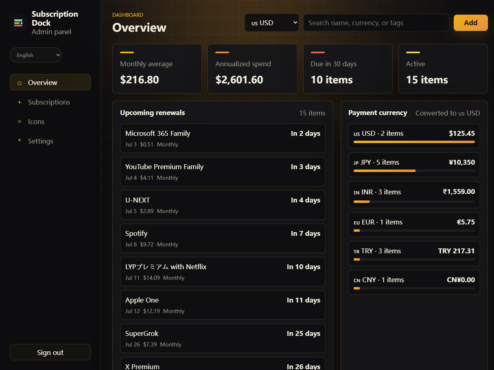
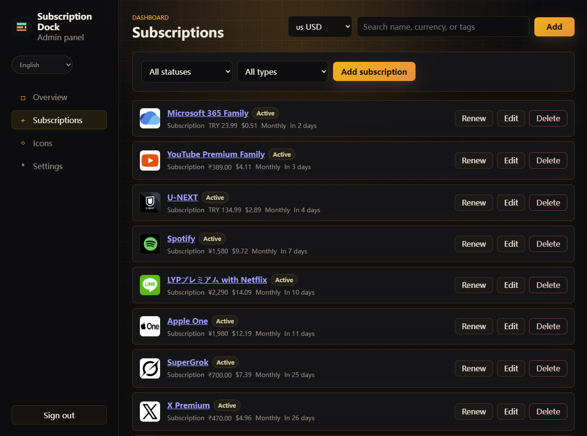

<div align="center">
  
  <h1>Subscription Dock</h1>
</div>

<div align="center">
  <strong>A calm, self-hosted home for subscriptions, renewals, and recurring costs.</strong><br>
  <strong>一个简洁、可自托管的订阅、续费与周期支出管理平台。</strong>
</div>

<br>

<div align="center">
  <a href="README_EN.md"><strong>English Documentation</strong></a>
  &nbsp;·&nbsp;
  <a href="README_CN.md"><strong>中文文档</strong></a>
</div>

<br>

<div align="center">
  
  
  
  
</div>

## What is Subscription Dock?

Subscription Dock brings recurring expenses into one focused dashboard. Track active subscriptions, understand monthly and yearly commitments, receive renewal reminders, and keep the data on infrastructure you control.

Subscription Dock 将散落的周期性支出集中到一个清晰的面板中：管理订阅、查看月度与年度成本、接收续费提醒，并将数据保留在你自己的服务器上。

## Highlights

| Track | Understand | Stay ahead |
|---|---|---|
| Manage subscriptions, domains, VPS plans, licenses, cloud services, memberships, and APIs. | See monthly and annual totals across 16 currencies, with optional Frankfurter reference-rate refresh. | Receive Pushover, Bark, or Telegram reminders before renewals. |
| 管理订阅、域名、VPS、许可证、云服务、会员和 API。 | 汇总 16 种货币的月度与年度成本，并可刷新 Frankfurter 参考汇率。 | 通过 Pushover、Bark 或 Telegram 接收续费提醒。 |

| Self-host | Dark by design | Guest-friendly |
|---|---|---|
| Deploy one dependency-free Node.js service with Docker; data stays in one portable JSON file. | A compact black-and-yellow interface with Chinese, English, and Japanese UI. | Guests can view the overview and subscriptions without write access. |
| 使用 Docker 部署无第三方运行依赖的 Node.js 服务，数据保存在一个可迁移的 JSON 文件中。 | 黑黄紧凑界面，支持中文、English、日本語。 | 访客只能查看总览和订阅，不能写入数据。 |

## Screenshots

| Overview | Subscriptions |
|---|---|
|  |  |

## Quick start

Download [`subscription-dock-v1.7z`](https://github.com/hefan230/Subscription-Dock/releases/latest/download/subscription-dock-v1.7z) from the latest GitHub Release, then run:

```bash
7z x subscription-dock-v1.7z
cd subscription-dock-v1
cp .env.example .env
nano .env
docker compose up -d --build
curl http://127.0.0.1:3537/healthz
```

Before the first start, change `ADMIN_USER`, `ADMIN_PASSWORD`, and `SESSION_SECRET` in `.env`. The Compose file binds `127.0.0.1:3537` by default for use behind a local reverse proxy.

## Documentation

- [English guide](README_EN.md)
- [中文指南](README_CN.md)
- [Deployment notes](docs/DEPLOYMENT.md)
- [Brand guide](docs/BRAND.md)
- [Contributing](CONTRIBUTING.md)
- [Security policy](SECURITY.md)
- [Roadmap](ROADMAP.md)
- [Changelog](CHANGELOG.md)

## Lightweight by design

The backend uses only Node.js 22 standard libraries—there are no npm runtime dependencies and no build step. Persistent state, settings, uploaded icons, and reminder history live in `data/subscription-dock.json`.

## Community

Bug reports, feature ideas, documentation improvements, and translations are welcome. Please read [CONTRIBUTING.md](CONTRIBUTING.md) before opening a pull request. For security issues, follow [SECURITY.md](SECURITY.md) instead of opening a public issue.

## License

Released under the [GNU General Public License v3.0](LICENSE).

<div align="center">
  <sub>Built to make recurring costs feel less recurringly surprising.</sub>
</div>
